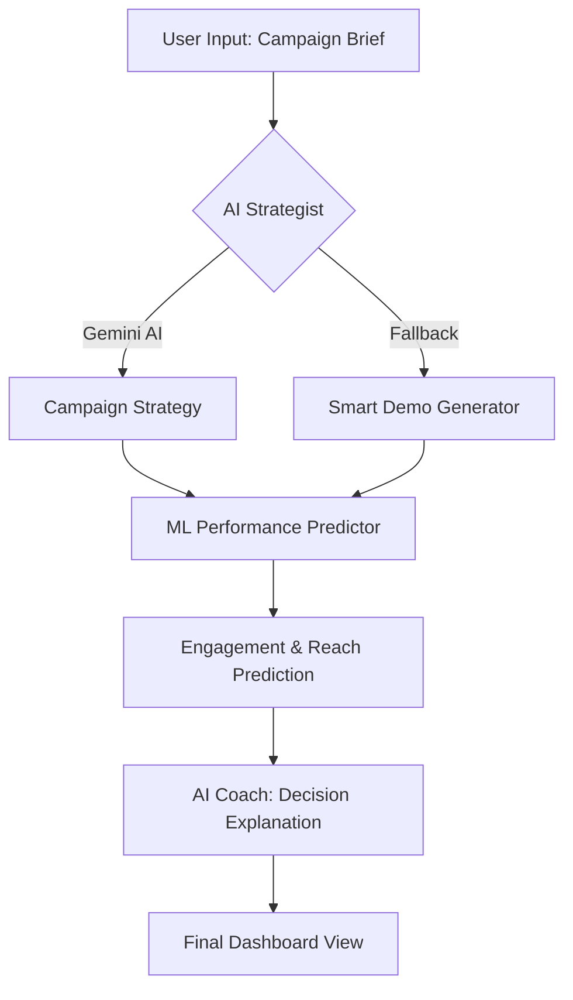

# 🚀 BrandPulse

**BrandPulse** is an AI-powered brand campaign strategist designed to help businesses launch effective marketing campaigns with data-driven insights. It combines advanced AI for strategy generation with Machine Learning for performance prediction, providing a comprehensive toolkit for modern marketers.

---

## ✨ Key Features

-   **🧠 AI Campaign Strategist**: Generates complete campaign strategies (product positioning, audience targeting, tone, and messaging) using Google Gemini AI.
-   **📈 ML Performance Prediction**: Predicts engagement rates and reach based on platform, content type, industry, and more.
-   **🔍 Competitor Analyzer**: Analyzes industry competitors and provides differentiation strategies.
-   **🤖 AI Campaign Coach**: Explains the "why" behind AI-generated decisions to build trust and transparency.
-   **💰 Budget Optimizer**: Provides intelligent budget allocation and ROI projections tailored for various markets.
-   **📱 Smart Demo Mode**: Seamlessly falls back to intelligent rule-based generation if AI/ML backends are unavailable.

---

## ⚙️ How it Works

---

Project Link: https://hacksync.vercel.app/

---

## 📄 License

This project is licensed under the MIT License - see the [LICENSE](LICENSE) file for details.
